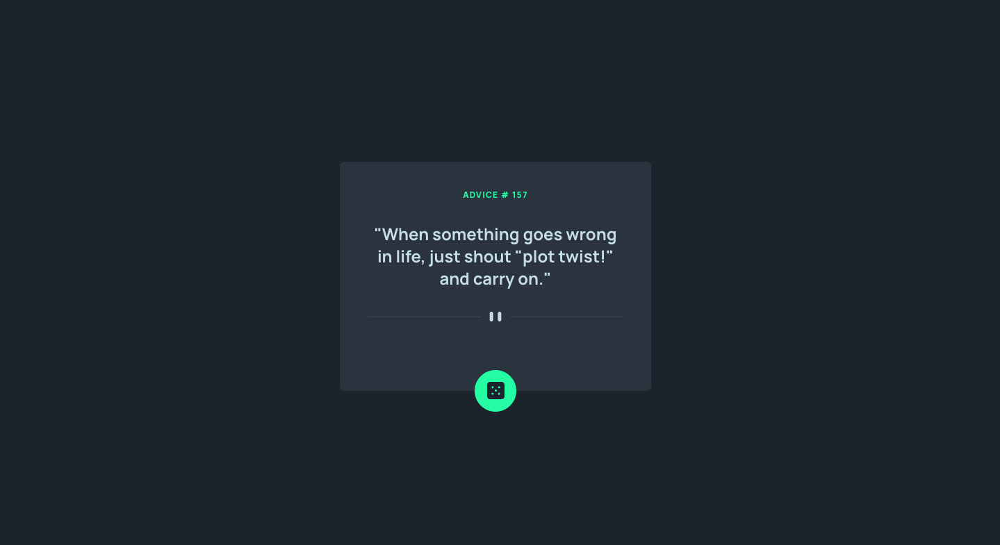
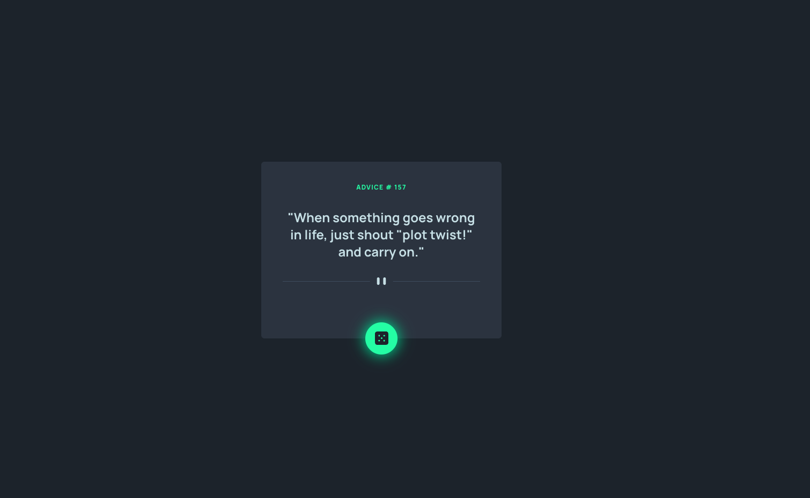
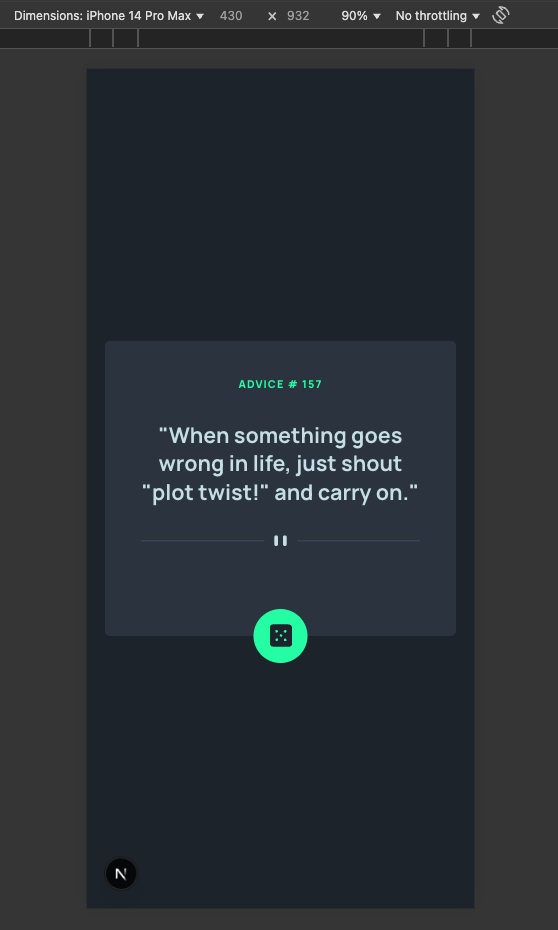

# Frontend Mentor - Advice generator app solution

This is a solution to the [Advice generator app challenge on Frontend Mentor](https://www.frontendmentor.io/challenges/advice-generator-app-QdUG-13db). Frontend Mentor challenges help you improve your coding skills by building realistic projects.

## Table of contents

- [Overview](#overview)
  - [The challenge](#the-challenge)
  - [Screenshot](#screenshot)
  - [Links](#links)
- [My process](#my-process)
  - [Built with](#built-with)
  - [What I learned](#what-i-learned)
  - [Continued development](#continued-development)
  - [Useful resources](#useful-resources)
- [Author](#author)

## Overview

### The challenge

Users should be able to:

- View the optimal layout for the app depending on their device's screen size
- See hover states for all interactive elements on the page
- Generate a new piece of advice by clicking the dice icon
- See skeleton loading while generating a new piece of advice 

This is a [Next.js](https://nextjs.org) project bootstrapped with [`create-next-app`](https://github.com/vercel/next.js/tree/canary/packages/create-next-app).

## Getting Started

First, run the development server:

```bash
npm run dev
# or
yarn dev
# or
pnpm dev
# or
bun dev
```

Open [http://localhost:3000](http://localhost:3000) with your browser to see the result.

You can start editing the page by modifying `app/page.js`. The page auto-updates as you edit the file.

### Screenshot

Desktop



Active State



Mobile


### Links

- Solution URL: [GIT](https://github.com/imalyssareyes/advice-generator-app)
- Live Site URL: [Vercel](https://advice-generator-app-imalyssareyes-projects.vercel.app/)

## My process

### Built with

- [React](https://reactjs.org/) - JS library
- [Next.js](https://nextjs.org/) - React framework
- [Tailwind CSS](https://tailwindcss.com/) - For styles
- [Vercel](https://vercel.com/) - For deployment

### What I learned

- How to use a framework like Next.js for building a web app
- Exploring different kind of data fetching in Next.js
- How to use Tailwind CSS for styling
- Adding a simple loader using Tailwind CSS once the app load and when clicking the dice for better user experience (not in the requirements)
- How to deploy a web app on Vercel and configure auto-deploy using webhooks in Git and Vercel

```html Tailwind classes for loading effect 
<p className="mb-8 h-5 bg-gray-400 rounded my-1 w-full animate-pulse"></p>
```

### Continued development

I would like to explore https://swr.vercel.app/docs/getting-started on future Next.js projects for data fetching.

### Useful resources

- [Skeleton Generator](https://www.skeletongenerator.com/) - This tool helped me on how to create a skeleton loading in Tailwind CSS

## Author

- Website - [Alyssa Reyes](https://www.alyssareyes.dev)
- Frontend Mentor - [@imalyssareyes](https://www.frontendmentor.io/profile/imalyssareyes)
